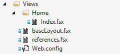
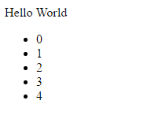

# FSTemplate

F# templating engine for ASP.NET. Inspired by [Elm View functions](http://crossingtheruby.com/2015/11/11/minimum-viable-elm-view.html)
> Write your ASP.NET templates in pure F#!!  

## How it works
1. Template is located in `Views` folder.
2. Script (*\*.fsx*) is compiled using [F# Compiler Services](https://fsharp.github.io/FSharp.Compiler.Service/compiler.html).
3. By using reflection, render function is exctracted from the compiled assembly.
4. Render function is executed by passing `Model` or `ViewContext` as a parameter.
5. Result of type `Node` is transformed into html.

## Template requirements
- Template script contains exactly one function with `[<Render>]` attribute on top
- Render function has one of the following signatures:
    - `Model -> Node`
    - `ViewContext -> Node`
    - `Model -> ViewContext -> Node`
    - `ViewContext -> Model -> Node`
    - `ViewContext * Model -> Node`
    - `Model * ViewContext -> Node`

## How to add

Install following NuGet package
```powershell
PM> Install-Package FSTemplate.Mvc
```

Add following code in your *Global.asax.cs* `Application_Start()` method:  
```csharp
FSTemplateBootstrapper.Bootstrap();

ViewEngines.Engines.Clear(); //optional
ViewEngines.Engines.Add(new FSViewEngine());
```

## Example
Let's say you have `HomeController` that returns a `View` with some model:
```csharp
public ActionResult Index()
{
    var model = new IndexModel
    {
        Name = "Hello World",
        Values = new[] { 0, 1, 2, 3, 4 }
    };
    return View(model);
}
```
and you have following `Views` folder structure:  
  
- *references.fsx* - contains all references that is needed for template compilation
    ```fsharp
    // actual FSTemplate library 
    #r "../bin/FSTemplate.dll"
    // web-app dll for referencing models or other classes
    #r "../bin/FSTemplate.Sample.dll"
    // other dependencies...
    ```
- *baseLayout.fsx* (optional) - base layout for the page. For example
    ```fsharp
    #load "references.fsx"
    open FSTemplate.Html
    open FSTemplate

    let baseLayout body = 
        html 
            [stylesheet "Content/Site.css"] 
            (body @ [script "Scripts/Site.js"])
    ```
- *Home/Index.fsx* - template for `Index` action
    ```fsharp
    #load "../references.fsx"
    #load "../baseLayout.fsx"

    open FSTemplate.Html
    open FSTemplate
    open FSTemplate.Sample.Models

    let transformValuesToLi values = 
        values 
        |> Array.map (fun x -> li [] [text (string x)])
        |> List.ofArray

    [<Render>]
    let index (model: IndexModel) = 
        BaseLayout.baseLayout [
            div [] [
                text model.Name; 
                ul [] (model.Values |> transformValuesToLi)
            ]
        ]
        
    ```

As a result request to `/Home/Index` returns following page:  


## Todo
- [x] Unit tests
- [x] Implementation of all html tags
- [ ] Integration tests
- [ ] ASP.NET Core bindings
- [ ] NancyFX bindings
- [ ] Config sections and loading configuration
- [ ] CSS rendering implementation